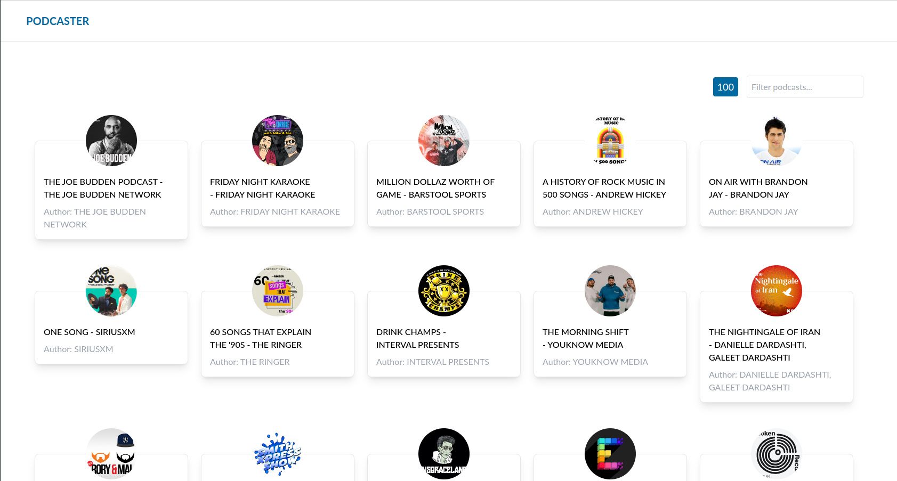
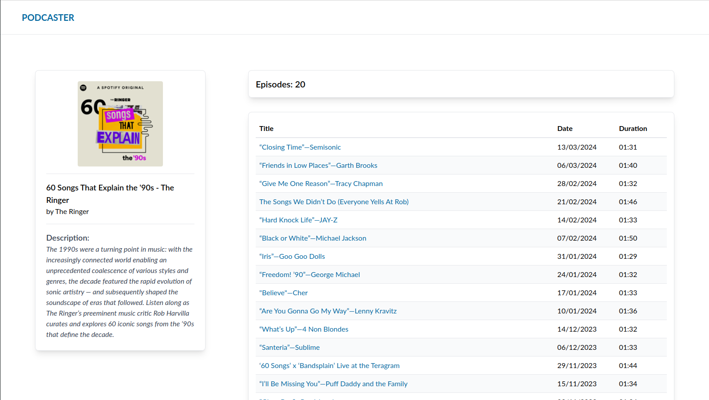

# Web App for Viewing and Listening to Apple Podcasts

## Table of Contents

- [Overview](#overview)
- [Features](#features)
  - [Home Page](#home-page)
  - [Podcast Page](#podcast-page)
  - [Episode Page](#episode-page)
- [Technologies Used](#technologies-used)
- [Getting Started](#getting-started)
  - [Prerequisites](#prerequisites)
  - [Production Mode](#production-mode)
  - [Development Mode](#development-mode)
  - [Running Tests](#running-tests)
- [License](#license)

## Overview

This web application provides an interface to view and listen to podcasts provided by Apple Podcasts, offering access to the most popular content and specific details of each episode.

## Features

### Home Page

- Displays the top 100 most listened-to podcasts, offering a selection of the most popular content.
- Shows the total number of results to inform the user about the breadth of the selection available.
- Includes a search function to filter within the top 100 most listened-to podcasts, facilitating the location of specific podcasts.

### Podcast Page

- Exhibits the image and relevant information of the selected podcast, providing context and details about it.
- Displays a table with up to 20 episodes of the podcast, allowing the user to explore and select episodes of interest.

### Episode Page

- Allows viewing specific details about the selected episode and offers the option to listen to it, enriching the user experience.

## Technologies Used

Built with TypeScript, React, and Vite, this application is a SPA (Single Page Application) that uses React Router for selective rendering of components based on the active route. The style is achieved through Tailwind CSS, and for queries and cache management, React Query is used. Testing is performed with Vitest to ensure the correct functionality of the application. Data from Apple Podcasts is validated using Zod schemas to guarantee the expected data structure.

## Getting Started

### Prerequisites

- Have Node 20+ installed.
- Install dependencies with `npm i`.

### Production Mode

- Build the application with `npm run build`.
- In `dist` you will find the static files ready for use. You can test them using, for example, [serve](https://www.npmjs.com/package/serve) by running `npx serve dist`.

### Development Mode

- Start the development server with `npm run dev` for hot reloading and dynamic page behavior.

### Running Tests

- To run the tests simply execute `npm test`.

## License

This project is under the GNU General Public License (GPL). For more information, consult the `LICENSE` file in this repository.
